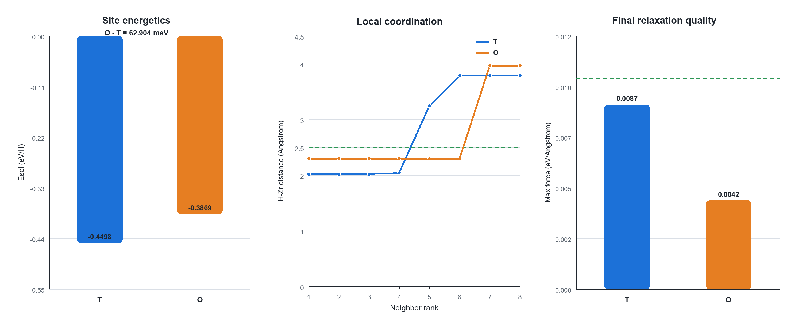

# Zr96-H 初始批次当前进度

**更新日期：** 2026-07-28  
**当前阶段：** 初始批次和 T/O 分析已完成；对称T2及TT_c/TO普通NEB预弛豫输入已生成，尚未提交  
**服务器项目：** `/work/home/liuzhixiao/Zr-ckj/07_h_diffusion_quickstart/`  
**本地结果归档：** [`../../07_H_diffussion_result/ZrH07_initial_results_20260728/`](../../07_H_diffussion_result/ZrH07_initial_results_20260728/)  

## 1. 本地归档与完整性

超算结果包已下载并解压，压缩包为：

```text
07_H_diffussion_result/ZrH07_initial_results_20260728.tar.gz
```

本地重新计算的 SHA-256 与随包校验文件完全一致：

```text
03876d4375003ceabe67ea7df84903e0f43a6ad1d15b179c302ecc1e447e6bc9
```

归档包含各任务的 `INCAR`、`POSCAR`、`KPOINTS`、`OUTCAR`、`OSZICAR`、`CONTCAR`、
`vasprun.xml`、`.run_status` 和 Slurm/VASP 日志，不包含受许可约束的 POTCAR，也不包含
WAVECAR、CHGCAR 等非本阶段分析必需的大文件。

## 2. 当前采用的计算集合

当前玩具任务的溶解能必须使用同一套新参数的以下数据：

```text
Zr96：     01_zr96_static/retry_dcu_01
H2：       02_h2_relax
Zr96H(T)： 03_t_relax/retry_dcu_01
Zr96H(O)： 04_o_relax/retry_dcu_01
```

新 Zr96、T 和 O 统一采用：

```text
ENCUT = 450 eV
EDIFF = 1E-6
LREAL = Auto
KPOINTS = Gamma-centered 4x4x3
```

实际 `OUTCAR` 显示 Zr96 static 有 8 个不可约 k 点，T/O relax 各有 26 个不可约 k 点。
这是 Zr96 使用 `ISYM=2`、T/O 使用 `ISYM=0` 所导致的正常对称性差异，不代表三者使用了
不同的显式 k 网格。`LREAL=Auto` 在实际运行参数中显示为 `LREAL=T`，也是预期行为。

旧 CPU `01_zr96_static`（Job `62040127`）也已正常完成并保存在结果归档中，其设置为
`5x5x4`，最终 `energy(sigma->0)=-818.00059399 eV`。它可作为旧高精度记录，但不能与新
`4x4x3` T/O 混合计算当前溶解能。当前热力学组合只使用新 Zr96 retry。

## 3. 任务验收结果

服务器运行 [`../tools/check_initial.sh`](../tools/check_initial.sh) 后四项均为 `PASS`：

| 任务 | Job ID | 离子步 | 最终 E0 (eV) | 最大力 (eV/A) | 状态 |
| --- | ---: | ---: | ---: | ---: | --- |
| 新 Zr96 `4x4x3` static | `62149576` | 不适用 | -818.11976349 | 0.00000000 | 正常结束，电子收敛 |
| H2 relax | `62040677` | 2 | -6.76804846 | 0.00328400 | 正常结束，电子/离子收敛 |
| T 初态 Zr96H relax | `62134983` | 13 | -821.95359478 | 0.00874278 | 正常结束，电子/离子收敛 |
| O 初态 Zr96H relax | `62148446` | 12 | -821.89069078 | 0.00420013 | 正常结束，电子/离子收敛 |

所有 `OUTCAR` 均含 `General timing and accounting`。H2、T、O 还含
`reached required accuracy`。T/O 最大力均低于本路线的 `0.01 eV/A` 验收门槛；其中 T 的
`0.00874278 eV/A` 已通过，但比较接近门槛。

服务器生成的原始汇总见
[`../../07_H_diffussion_result/ZrH07_initial_results_20260728/07_h_diffusion_quickstart/01_initial/initial_summary.tsv`](../../07_H_diffussion_result/ZrH07_initial_results_20260728/07_h_diffusion_quickstart/01_initial/initial_summary.tsv)。

## 4. 当前能量学结果

采用最终 `energy(sigma->0)`，溶解能定义为：

```text
Esol(site) = E0[Zr96H(site)] - E0[Zr96] - 1/2 E0[H2]
```

得到：

| 初始位标签 | Esol (eV/H) | 相对 T 的能量 (eV) |
| --- | ---: | ---: |
| T | -0.44980706 | 0.00000000 |
| O | -0.38690306 | +0.06290400 |

本地最小镜像和配位分析已经确认两份末态是不同配位驻点：T 末态 H 的最近四个 Zr-H 距离
为 `2.01772–2.04224 A`，O 末态最近六个约为 `2.29655 A`，二者 H 位点相距
`1.98514991 A`。因此可以确认当前 T 构型比 O 高对称构型低 `0.062904 eV`
（`62.904 meV`），且二者相对 `1/2 E(H2)` 的溶解能均为负。O 从精确对称中心起算，零力
本身不能排除鞍点；但已有 α-Zr-H 振动/声子研究报告 T、O 均无虚频，因此 O 可归类为
文献支持的亚稳局域极小。本项目未自行完成声子验证。

## 5. 本地分析产物

可复现脚本 [`../tools/analyze_initial.py`](../tools/analyze_initial.py) 已生成
[`analysis/`](analysis/) 中的三个 TSV、六组 PNG/PDF 图，并通过数值回归和视觉检查。其中
[`03b_t_h_initial_final.png`](analysis/03b_t_h_initial_final.png) 对比了 T 位初始/末态 H
位置，并用单独的坐标放大图显示其主要沿 `+c` 方向的微小位移。

- 详细归纳报告：[`../doc/Zr96-H初始数据分析与归纳-20260728.md`](../doc/Zr96-H初始数据分析与归纳-20260728.md)
- 精简分享报告：[`../doc/Zr96-H初始结果精简分享-20260728.md`](../doc/Zr96-H初始结果精简分享-20260728.md)



## 6. 后续路线

配位身份已经确认。O 的离位扰动仍可作为独立稳定性复核，但不是当前玩具扩散流程的前置条件。
当前 T 末态已通过空间群对称操作整体映射成最近的 c 向 T2；该操作同时转移 H 和局域 Zr
松弛场，并用理想宿主结构做一一原子置换，因此不再计算第二份端点波函数。

[`../02_endpoints/01_tt_c_symmetry/`](../02_endpoints/01_tt_c_symmetry/) 记录 T2 和完整映射；
[`../03_neb/01_tt_c/`](../03_neb/01_tt_c/) 与
[`../03_neb/02_to/`](../03_neb/02_to/) 已含 00–05 图像。下一步在 SCNet 组装私有 POTCAR，
先做 `TT_c` 普通NEB预弛豫（`EDIFFG=-0.10 eV/A`），再由其 `CONTCAR` 建立
CI-NEB（`LCLIMB=.TRUE.`、`EDIFFG=-0.03 eV/A`）；TT验收后再按相同两阶段路线做TO。
纯基面 `3.2342 A` T→T 直连路径暂不计算，因为它包含
T→O→T 两个基本跳跃，不能解释成单个基本跃迁。

本路线仍属于流程演示/玩具任务：没有完成 Zr-H 专门的 k 点、ENCUT、有限尺寸、6 图像或
振动/ZPE验证，不能把后续势垒表述为高精度扩散参数。
