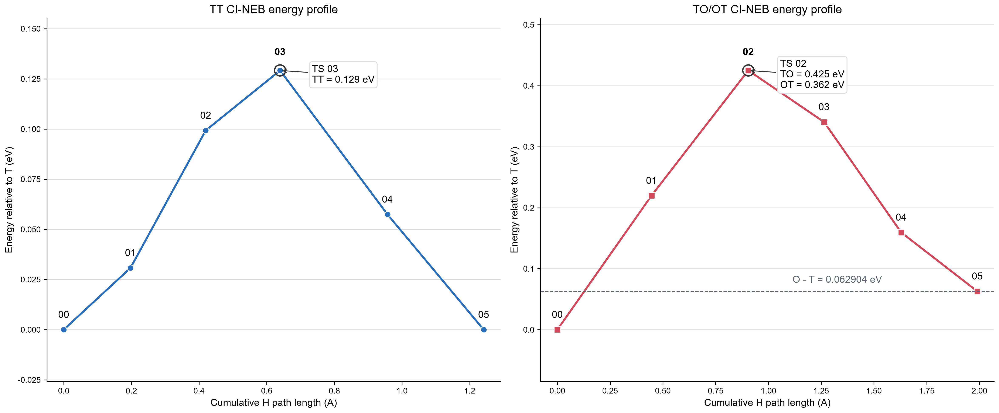
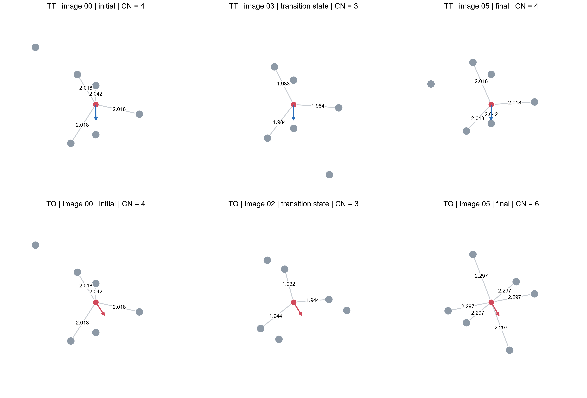
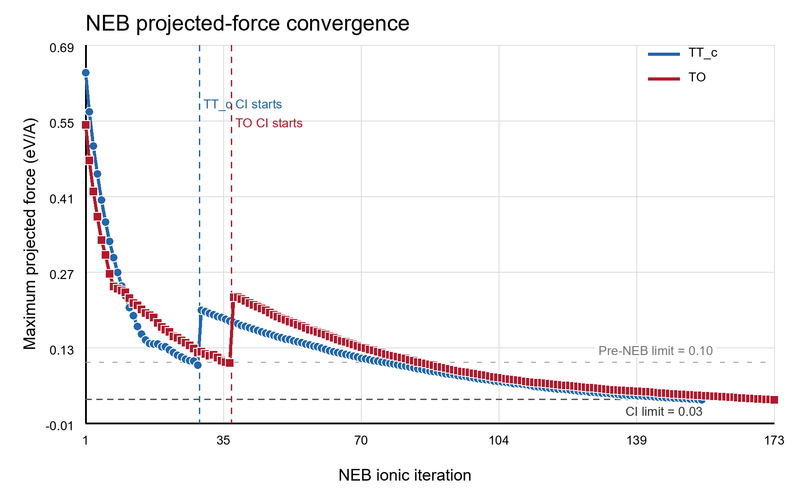
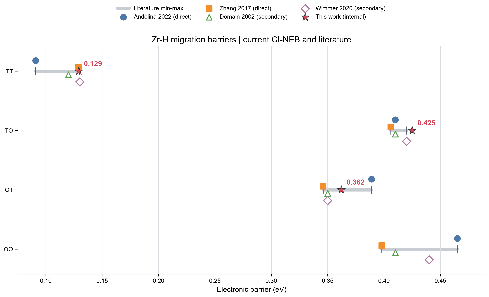

# Zr96-H 氢扩散 CI-NEB 快速验证

本仓库记录 α-Zr 96 原子超胞中单 H 的初始位点弛豫、扩散端点构造，以及 TT、TO/OT 两条
基本跳跃的普通 NEB 与 CI-NEB 计算。当前结果用于流程验证和数量级分析，不作为已经完成系统
参数收敛的高精度扩散数据。

当前路线为：

```text
已完成的高精度 CPU Zr96 static 与 H2 relax 保留
  -> 旧 5×5×4 CPU T/O relax 因运行过慢停止，原始输出保留
  -> 以统一 4×4×3 DCU 设置完成新的 Zr96 static、T relax 和 O relax
  -> 确认 T/O 为四配位/六配位不同末态，并用同设置 Zr96 基准计算溶解能
  -> 由 T 末态的全结构精确对称映射生成等能 T2，不重复计算第二端点
  -> TT_c 与 TO 的 4 图像普通 NEB 均通过 0.10 eV/Å 预弛豫门槛
  -> TT CI-NEB 通过验收，正式势垒 0.129 eV
  -> TO CI 首次运行完成 1 步后主动取消；96-CPU 续算在启动器层段错误
  -> 恢复 128-CPU/16-DCU 布局并从有效 CONTCAR 续算，TO/OT 最终通过验收
  -> 正式势垒为 TT 0.129 eV、TO 0.425 eV、OT 0.362 eV
```

## 主要结果

当前计算设置为 PBE/PAW、`ENCUT = 450 eV`、Gamma-centered `4 × 4 × 3` k 点网格、
4 个中间图像，以及 `0.03 eV/Å` 的最终 CI-NEB 投影力门槛。

| 跳跃 | 方向 | 鞍点图像 | 正式电子势垒 (eV) | 最终全路径最大投影力 (eV/Å) | 验收 |
| --- | --- | ---: | ---: | ---: | --- |
| TT | T1 → 对称等价 T2 | `03` | **0.12919004** | 0.029753 | 通过 |
| TO | T → O | `02` | **0.42502420** | 0.029600 | 通过 |
| OT | O → T，反向读取同一条 TO 计算带 | `02` | **0.36212020** | 与 TO 共用 | 通过 |

TO 与 OT 的势垒差满足独立的热力学闭合关系：

```text
TO - OT = E0(O) - E0(T) = 0.06290400 eV
```

两条最终 CI 轨迹都在最后一个离子步首次低于 `0.03 eV/Å`。TT 和 TO 的力裕量分别只有
`0.000247` 和 `0.000400 eV/Å`，因此结论是“按当前标准通过，但力裕量较小”。力门槛不能
直接解释为势垒的不确定度。



## 初始数据血缘与能量组合

初始批次不是把所有“看起来更精细”的数据直接混在一起，而是先保证能量差中的 Zr96 与
Zr96H 使用同一数值设置。旧 CPU 与新 DCU 数据的职责如下：

| 数据 | 数值设置 | 运行结果 | 当前用途 |
| --- | --- | --- | --- |
| 旧 CPU Zr96 static，Job `62040127` | `5×5×4`、`EDIFF=1E-7`、`LREAL=.FALSE.` | 完成，`E0=-818.00059399 eV` | 高精度历史参考，不混入当前溶解能 |
| 旧 CPU T/O relax，Jobs `62040731/62040755` | `5×5×4`、`EDIFF=1E-7`、`LREAL=.FALSE.` | 因运行过慢停止 | 只保留原始输出，不作为完成的 T/O 结果 |
| 新 DCU Zr96 static，Job `62149576` | `4×4×3`、`EDIFF=1E-6`、`LREAL=Auto` | 完成，`E0=-818.11976349 eV` | 与新 T/O 同设置的当前 Zr96 能量基准 |
| 新 DCU T/O relax，Jobs `62134983/62148446` | `4×4×3`、`EDIFF=1E-6`、`LREAL=Auto` | 13/12 步收敛 | 当前 T/O 末态结构与能量 |
| 既有 H2 relax，Job `62040677` | Gamma-only、`EDIFF=1E-8`、`LREAL=.FALSE.` | 2 步收敛，`E0=-6.76804846 eV` | 独立分子化学势参考，保留使用 |

旧 CPU Zr96 并没有算错；它只是与新 DCU T/O 的 k 网格、电子阈值和实空间投影设置不同。
新 Zr96 因此只做 `IBRION=-1、NSW=0、ISYM=2` 的单点 static，以获得与新 T/O 可配套的
宿主能量，不需要再次弛豫理想 Zr96。新旧 Zr96 的绝对 E0 相差约 `0.11917 eV`，也说明不能
跨设置拼接能量差。

当前溶解能严格使用：

```text
Esol(T/O)
= E0[4×4×3, Auto 的 Zr96H(T/O) relax 末态]
- E0[4×4×3, Auto 的 Zr96 static]
- 1/2 E0[既有 H2 relax]
```

T/O 的正式端点能量直接读取各自 relax 最后一个 `energy(sigma->0)`，没有另做 `5×5×4`
高精度 final static，也不能用 `TOTEN` 替代 E0。H2 是独立分子参考，已在 Gamma-only 设置下
高精度收敛，因此本轮不因 Zr96/T/O 改用 DCU 而重复计算。

## 路径与迁移机制

- `TT_c`：四配位 T1 经三配位三角面瓶颈迁移到沿 c 方向相邻的四配位等价 T2。
- `TO/OT`：四配位 T 经三配位三角面瓶颈迁移到六配位 O；OT 是同一条计算带的反向势垒，
  不是第三次独立 NEB 计算。
- TT 鞍点为图像 `03`；TO/OT 鞍点为图像 `02`。
- 两条路径均未发现回跳、相邻图像塌缩或大范围 Zr 重构。全路径最短原子距离分别为
  `1.98330676 Å`（TT）和 `1.93234117 Å`（TO）。
- 当前单条微观跳跃势垒不能直接等同于宏观 c 轴或基面扩散活化能；宏观输运还需要完整跳跃
  网络、位点占据和尝试频率。

T2 不是只把 H 平移到另一个理想间隙中心。端点生成器对 T1 末态的全部 97 个原子应用精确
晶体对称操作

```text
S(x,y,z) = (x,y,7/6-z) mod 1
```

并用未弛豫 T-POSCAR 确定 96 个 Zr 的一一行置换，将 H 偏移和局域 Zr 松弛场一起映射。
理想结构的最大映射残差约为 `2.8×10^-15 Å`，因此 T2 与 T1 在同一哈密顿量下严格等能，
无需再做一次端点 SCF、static 或 relax。理想 T 中心距离 `1.29150537 Å` 与包含实际松弛偏移
后的 H 端点距离 `1.24144250 Å` 含义不同，不能混用。

TO 的实际 H 端点位移为 `1.98514991 Å`，其中基面分量 `1.86838910 Å`、有符号 c 分量
`-0.67077742 Å`。本项目没有把 `3.2342 Å` 的纯基面 T→T 直连当作一个基本跳跃，因为它
对应 T→O→T 的较长复合路径。两条路径的四个中间图像均采用逐原子最小镜像插值，不使用
`nebmake.pl`。



## 收敛与验收证据

普通 NEB 先将两条计算带预弛豫到 `0.10 eV/Å`，随后 CI-NEB 以 `LCLIMB = .TRUE.` 收敛到
`0.03 eV/Å`。TT 共记录 `29 + 126` 个预弛豫/CI 力步，TO 共记录 `37 + 1 + 135` 个力步。
两条路径最后 12 步的全路径最大投影力均严格下降，电子迭代达到 `EDIFF`，最终结构和阶段
血缘检查通过。

### 普通 NEB 的 HDF5 收尾异常

TT pre-NEB（Job `62213597`）在 29 个离子步后达到 `0.10 eV/Å` 门槛，四幅中间图像的
最终投影力最大值为 `0.094234 eV/Å`。TO pre-NEB（Job `62307728`）在 37 步后达到同一
门槛，最终最大值为 `0.098468 eV/Å`。两次作业均已完整写出各图像 OUTCAR 和科学结果，
随后在 VASP 的 IMAGES/HDF5 收尾阶段触发已知 `vhdf5.F error 29`，因此原始
`vasp_exit=1`。

验收将这种情况明确记录为 `PASS_HDF5_POSTRUN`，而不是把非零退出码改成成功。只有同时满足
以下条件才允许接受：错误文本精确匹配已知 error 29、各图像科学输出完整、电子迭代收敛、
投影力达到阶段门槛，并且没有其他 fatal 模式。任何发生在科学输出完成前的 HDF5/启动错误、
未知非零退出或缺失图像输出都不能套用这一例外。

### TO CI 的失败与续算血缘

- `ci_01`，Job `62470978`：使用 4 节点、128 CPU task 和 16 DCU，VASP 成功启动并为四幅
  图像各完成 1 个 CI 离子步。作业后来为了测试缩减 CPU 申请而主动取消，不是数值失败。
- `ci_02`，Job `62474917`：从 `ci_01/01..04/CONTCAR` 续算，但将每节点申请从 32 CPU
  减到 24 CPU 后，7 秒内四节点启动进程同时段错误；`vasp.stdout` 为空，科学计算没有开始。
  该 A/B 结果指向 Slurm CPU 集合、旧 Intel MPI/Hydra 与 `numactl` NUMA 绑定的启动兼容
  问题，但单次失败不能证明精确触发机制。
- `ci_03`，Job `62475824`：继续使用 `ci_01` 已完整写出的四个 CONTCAR，不退回粗 NEB
  几何；恢复唯一已实际验证能够启动的 4 节点、128 CPU、16 DCU 布局，随后完成 135 个记录
  并以 `0.029600 eV/Å` 通过最终门槛，得到 TO/OT 正式势垒。

`ci_01`、失败的 `ci_02` 和最终 `ci_03` 均保留原始证据。启动失败的 `ci_02` 不计入科学
离子步，也不能解释为势垒或结构收敛失败。



机器可读结果包括：

- [路径级势垒与验收摘要](03_neb/analysis/neb_summary.tsv)
- [逐图像能量剖面](03_neb/analysis/neb_profile.tsv)
- [分阶段投影力历史](03_neb/analysis/neb_convergence.tsv)
- [逐图像结构与配位指标](03_neb/analysis/neb_image_details.tsv)
- [路径几何检查](03_neb/analysis/path_geometry.tsv)
- [文献势垒对照](03_neb/analysis/neb_literature_comparison.tsv)

## 初始位点结果

初始批次使用同一套新参数的 Zr96、T 和 O 结果，并保留既有 H2 参考。当前设置下：

| 位点 | 溶解能 (eV/H) | 相对 T 能量 (eV) | 最近邻配位 |
| --- | ---: | ---: | ---: |
| T | -0.44980706 | 0.00000000 | 4 |
| O | -0.38690306 | +0.06290400 | 6 |

T/O 松弛、能量、局域配位和结构身份的完整历史分析见
[Zr96-H 初始数据分析与归纳](01_initial/Zr96-H初始数据分析与归纳-20260728.md)。原始输出已同步到
`01_initial/`，派生的 TSV、PNG 和 PDF 位于 `01_initial/analysis/`。


## 势文件身份与复算约束

所有可比较的 Zr96、Zr96H 端点和 NEB 计算必须使用同一套 PAW 势身份：

```text
Zr_sv: PAW_PBE Zr_sv 04Jan2005
SHA-256: 25aed69cb10325f9d37c5c68912b61a17387d1f8e4f1d804860ffa10c8a4bf76

H: PAW_PBE H 15Jun2001
SHA-256: b9ed9e0fd4e660c858a39f59be6bb91671733b1136a5cd56b772198ffb3ec7fb
```

不得把 `Zr_sv 04Jan2005` 换成名称相似但内容不同的 `Zr_sv 07Sep2000`；二者不是可互换的同一
势文件。复算时应通过 `ZR_SV_POTCAR`、`H_POTCAR` 等环境变量向组装脚本提供私有势，并按
解压后的实际内容核对 SHA-256。压缩或未压缩存储形式可以不同，势内容哈希必须一致。

POTCAR 只在计算环境本地组装，不提交到 Git，也不从公共 GitHub 仓库分发。输入 manifest
只保留势身份和内容哈希，不能用文件名相同代替内容验证。

## 仓库结构

```text
.
├── 01_initial/       # Zr96、H2、T/O 初始计算、原始输出与派生分析
├── 02_endpoints/     # 由晶体对称性生成的等价 T2 端点与映射记录
├── 03_neb/           # TT、TO 的 pre-NEB/CI-NEB 输入、结果和分析产物
├── tools/            # 检查、阶段生成、势垒分析和报告资产构建工具
├── .gitattributes    # Git LFS 与行尾规则
└── README.md
```

VASP 授权势文件不进入仓库。`POTCAR`、重启文件和可能嵌入完整势内容的 HDF5 输出由忽略规则
排除；大型 `OUTCAR`、`vasprun.xml`、`XDATCAR` 和 `vasp.stdout` 使用 Git LFS 管理。

## 复算与检查

以下命令均从仓库根目录执行。

重新生成初始分析：

```bash
python tools/analyze_initial.py \
  --results-root 01_initial \
  --output-dir 01_initial/analysis
```

运行核心 NEB 工具测试：

```bash
python tools/test_neb_tools.py
```

完整 NEB 报告资产构建器位于
[`tools/build_neb_report_assets.py`](tools/build_neb_report_assets.py)。重新生成图表需要本地保留的
下载归档、NumPy、Pillow 和 Matplotlib。

## 科学边界

当前结果尚未完成以下系统验证：

- 没有做 T/O 的 `5×5×4` 高精度 final static；当前端点能量来自 `4×4×3` relax 末态 E0。
- 没有做 CPU/DCU 绝对能量复现，也没有把旧 CPU Zr96 与新 DCU T/O 混合计算溶解能。
- 没有做 `3×3×2` k 点对照、Zr-H 专门的系统 k 点收敛或 `LREAL=Auto` 对缺陷能差的误差检查。
- 没有完成 ENCUT、超胞尺寸和有限尺寸系统收敛。
- 没有用至少 6 个中间图像复核鞍点位置，也没有把最终 CI 力继续压到 `0.01 eV/Å`。
- 没有对端点或鞍点做 Hessian/声子分析，因而没有自行证明 O 位无虚频或鞍点恰有一个虚频。
- 没有加入零点能、有限温度振动自由能、非谐效应或核量子效应。
- 没有完成 OO、长程 TT、替代最小能量路径或缺陷辅助路径的系统搜索。
- 没有完整跳跃网络、位点占据和尝试频率，不能由三条静态势垒直接推出扩散系数或宏观各向异性。

因此，应将 `0.129/0.425/0.362 eV` 表述为当前离散设置下通过既定验收标准的 CI-NEB 电子
势垒，不应宣称为严格收敛的实验活化能或有限温度自由能势垒。


