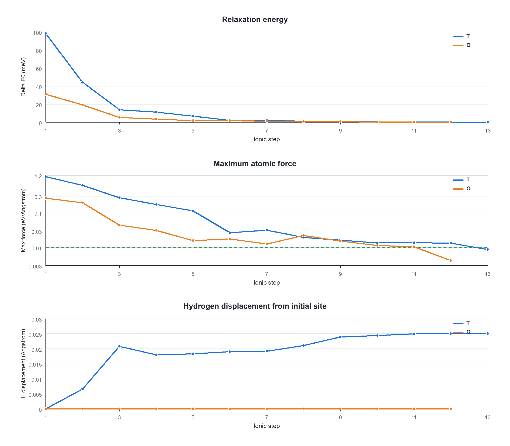
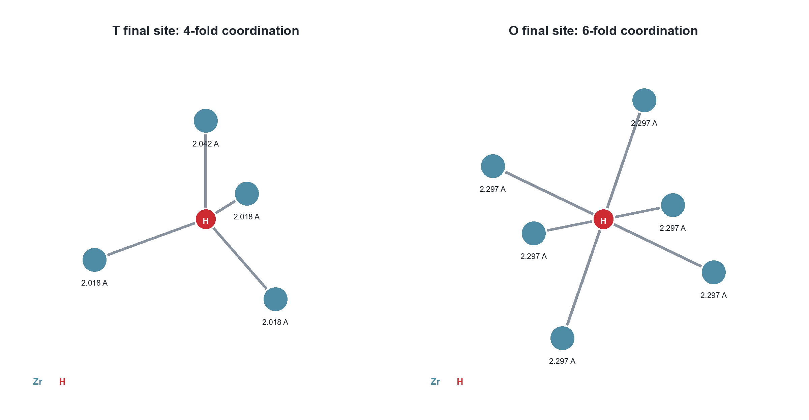
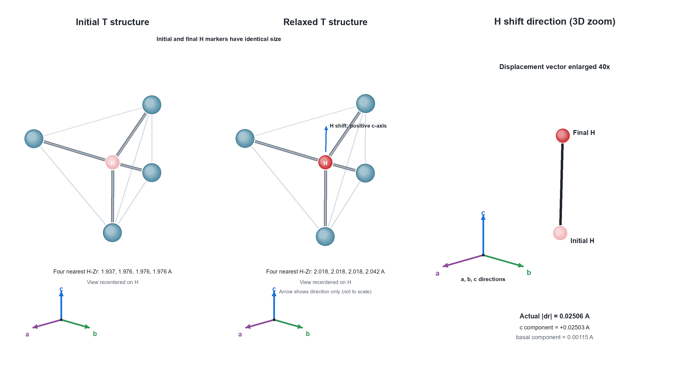
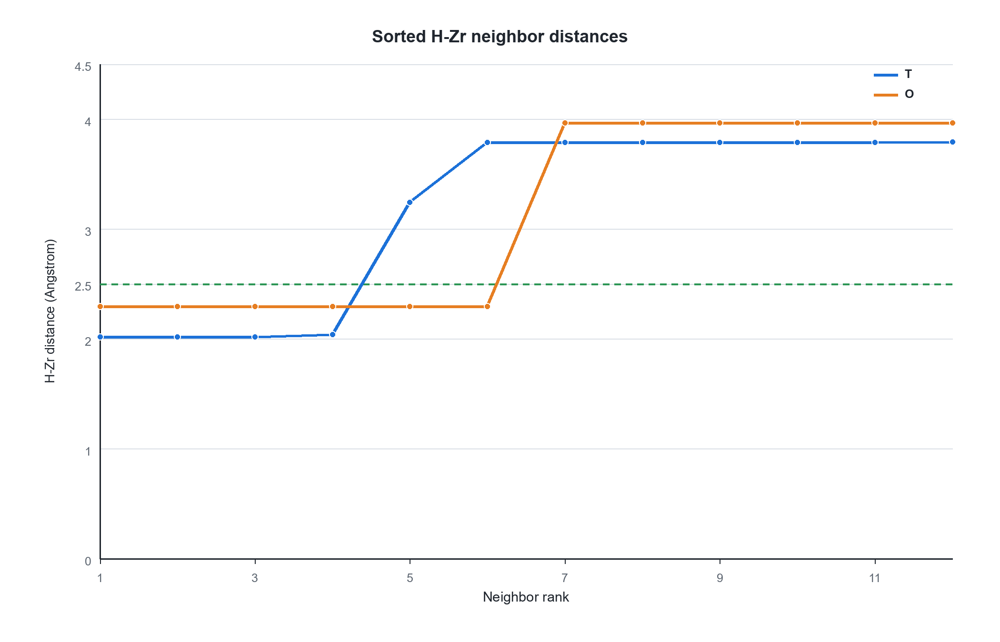
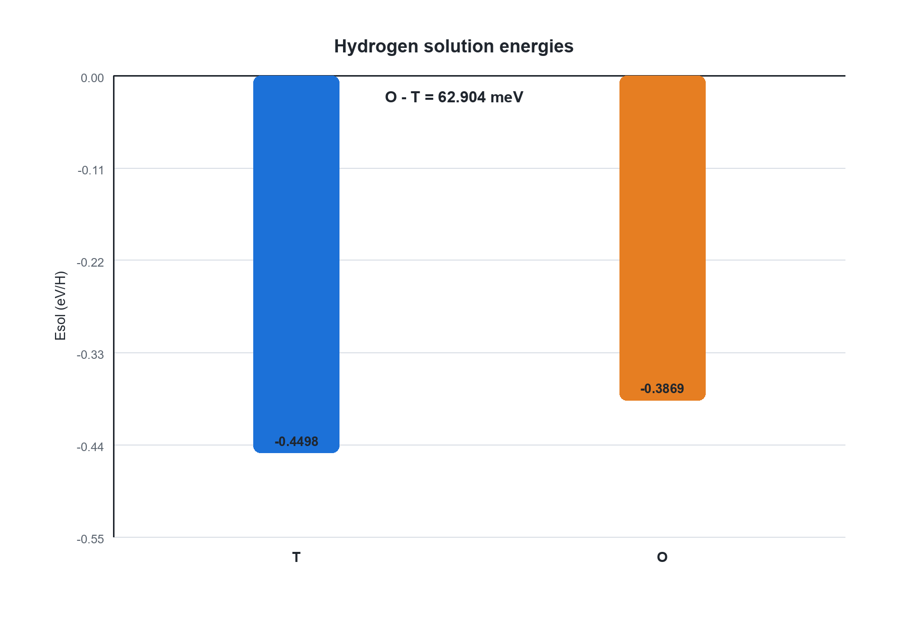

# Zr96-H 初始数据分析与归纳

**报告日期：** 2026-07-28  
**计算阶段：** Zr96、H2 与 Zr96H(T/O) 初始批次  
**结果性质：** `4x4x3` DCU 玩具任务/流程演示  
**当前结论：** T、O 初态分别保持为四配位和六配位的不同末态；T 更低能，O 为文献振动分析支持的亚稳局域极小  

## 1. 摘要

新 `4x4x3` Zr96 static、T relax 和 O relax，以及既有 H2 relax 均正常结束并通过电子/离子
收敛检查。T 和 O 分别经过 13、12 个离子步达到最大力 `0.00874278` 和
`0.00420013 eV/A`，低于本路线的 `0.01 eV/A` 门槛。

最小镜像结构分析表明，T 末态的 H 仅移动 `0.02505775 A`，最近四个 Zr-H 距离为
`2.01772–2.04224 A`；O 末态的 H 位移仅 `0.00000669 A`，最近六个 Zr-H 距离约为
`2.29655 A`。二者的 H 位点相距 `1.98514991 A`，因此没有塌陷到同一个末态，可以作为
两个结构不同的驻点比较。仅凭本次对称起点 relax，O 的零力只能证明它是驻点；但已有
α-Zr-H 振动和声子研究报告 O 位无虚频，并将其判定为亚稳局域极小。本项目未自行重复该
振动验证，因此这里采用“本项目结构结果与文献局域稳定性结论一致”的表述。

使用匹配的新 `4x4x3` Zr96 参考和现有 H2 参考，得到：

```text
Esol(T) = -0.44980706 eV/H
Esol(O) = -0.38690306 eV/H
E0(O) - E0(T) = +0.06290400 eV
```

在当前计算设置下，T 比 O 低 `62.904 meV`。该结论只适用于当前玩具任务，尚未经过
Zr-H 专门的 k 点、ENCUT 或有限尺寸收敛验证。

## 2. 数据来源与完整性

超算原始结果保存在本地下载归档：

[`../../07_H_diffussion_result/ZrH07_initial_results_20260728/`](../../07_H_diffussion_result/ZrH07_initial_results_20260728/)

压缩包 `ZrH07_initial_results_20260728.tar.gz` 的本地 SHA-256 与随包校验文件一致：

```text
03876d4375003ceabe67ea7df84903e0f43a6ad1d15b179c302ecc1e447e6bc9
```

分析使用 `OUTCAR` 的最后一个 `energy(sigma->0)`，没有用 `TOTEN` 替代。完成性由
`General timing and accounting`、电子达到 `EDIFF`、relax 的
`reached required accuracy`、最终力和 `.run_status` 共同判断，而不是仅凭文件存在。

本地派生数据由 [`../tools/analyze_initial.py`](../tools/analyze_initial.py) 从原始结果生成：

- [`initial_metrics.tsv`](../01_initial/analysis/initial_metrics.tsv)：任务级能量、力、步数、耗时和结构指标；
- [`relax_trajectory.tsv`](../01_initial/analysis/relax_trajectory.tsv)：T/O 逐离子步能量、力和 H 位移；
- [`neighbor_distances.tsv`](../01_initial/analysis/neighbor_distances.tsv)：T/O 排序 H-Zr 距离。

分析脚本不读取 POTCAR，也不准备或启动 VASP。

## 3. 方法与新旧数据隔离

当前热力学组合固定为：

| 体系 | 使用目录 | 用途 |
| --- | --- | --- |
| Zr96 | `01_zr96_static/retry_dcu_01` | 新 `4x4x3` 宿主参考 |
| H2 | `02_h2_relax` | 分子氢参考 |
| Zr96H(T) | `03_t_relax/retry_dcu_01` | T 初态固定晶格 relax |
| Zr96H(O) | `04_o_relax/retry_dcu_01` | O 初态固定晶格 relax |

新 Zr96/T/O 均使用 `ENCUT=450 eV`、`EDIFF=1E-6`、`LREAL=Auto`、Gamma-centered
`4x4x3`。T/O 使用 `ISIF=2`、`ISYM=0`、`EDIFFG=-0.01 eV/A`；Zr96 static 使用
`ISYM=2`。因此实际不可约 k 点数为 Zr96 的 8 和 T/O 的 26，这来自对称性差异，不是显式
k 网格不一致。`OUTCAR` 中 `LREAL=T` 是 `Auto` 的实际选择。

旧 CPU `01_zr96_static`（`5x5x4`）已正常完成，E0 为 `-818.00059399 eV`；它保留为历史
高精度参考，但不能与新 `4x4x3` T/O 混合计算本报告的溶解能。旧 T/O CPU relax 由用户主动
停止，也不作为收敛结果或能量来源。

## 4. 计算质量

| 体系 | Job ID | 离子步 | E0 (eV) | 最大力 (eV/A) | 墙时 | 结论 |
| --- | ---: | ---: | ---: | ---: | ---: | --- |
| 新 Zr96 static | `62149576` | 1 | -818.11976349 | 0.00000000 | 628.638 s | 正常结束、电子收敛 |
| H2 relax | `62040677` | 2 | -6.76804846 | 0.00328400 | 163.113 s | 正常结束、电子/离子收敛 |
| T relax | `62134983` | 13 | -821.95359478 | 0.00874278 | 14558.622 s | 正常结束、电子/离子收敛 |
| O relax | `62148446` | 12 | -821.89069078 | 0.00420013 | 13146.954 s | 正常结束、电子/离子收敛 |

T 首个离子步相对末态高 `98.22 meV`，O 高 `31.02 meV`。两条能量轨迹总体下降；最大力在
个别离子步有小幅回升，但最终均跨过 `0.01 eV/A` 门槛。T 的最终力更接近门槛，因此当前
结果可以进入玩具端点阶段，但不应包装为高精度位点能量。



图1：T/O 的相对末态能量、最大原子力和 H 最小镜像位移。绿色虚线是
`0.01 eV/A` 力门槛。

H2 从初始 `0.75000000 A` 弛豫到 `0.75039343 A`，2 个离子步后最大力为
`0.00328400 eV/A`，符合其 `EDIFFG=-0.005 eV/A` 设置。

## 5. T/O 末态结构身份

### 5.1 H 坐标与位移

| 初态标签 | 初始 H 分数坐标 | 最终 H 分数坐标 | H 位移 (A) |
| --- | --- | --- | ---: |
| T | `(0.3333333333, 0.4166666667, 0.5416666667)` | `(0.3332308586, 0.4166154327, 0.5432817995)` | 0.02505775 |
| O | `(0.5000000000, 0.5000000000, 0.5000000000)` | `(0.4999999993, 0.5000000006, 0.5000004320)` | 0.00000669 |

T/O 两份 `POSCAR` 与 `CONTCAR` 具有相同晶格、`Zr H / 96 1` 元素顺序和相同原子索引。
所有位移均以实际非正交晶格中的严格最小镜像计算。

### 5.2 局域配位

以 `2.5 A` 作为本批数据的审计截断：

- T 的前四个 Zr-H 距离为 `2.01771873`、`2.01771888`、`2.01817150`、
  `2.04224409 A`，第五近邻跃升到 `3.24341867 A`；
- O 的前六个 Zr-H 距离为 `2.29654980–2.29655468 A`，第七近邻跃升到
  `3.96585159 A`。

两者均存在清晰的第一配位壳层间隙，分别呈四配位与六配位，符合 α-Zr 中 T/O 位点族的
常见结构识别；已有 α-Zr 第一性原理研究也以四配位 T 和六配位 O 描述 H 间隙位置
([Andolina 等，2022](https://doi.org/10.1016/j.commatsci.2022.111384))。T/O 最终 H 位点
之间的最小镜像距离为 `1.98514991 A`，进一步排除了两次 relax 收敛到同一位置的可能。



图2：T/O 末态第一配位壳层示意。图中距离由周期性最小镜像计算。



图2b：T 位弛豫前后的局域结构和 H 位移方向。左、中两图分别以 H 为中心显示初始结构与
末态结构，观察方向、空间比例和 H 标记大小完全一致；浅色、深色只区分初始和末态，不表示
原子大小变化。中图蓝色细箭头表示 H relax 的实际方向，但箭头长度不按比例；右图在相同三维
投影下将 H 位移矢量放大 `40` 倍，并标出实际晶格 `a/b/c` 方向，显示 H 主要沿 `+c` 方向
移动。右图只放大位移，不能与配位距离按同一比例比较。



图3：排序 H-Zr 距离。绿色虚线为 `2.5 A` 审计截断；T 在第4近邻后跳变，O 在第6近邻后
跳变。

宿主 Zr 的位移也保持局域：T relax 中 Zr 位移 RMS/最大值为
`0.01532792/0.07996085 A`，O 中为 `0.01101930/0.03418425 A`。当前没有观察到 H 离开
初始位点族或引起异常大范围结构重排的证据。

### 5.3 位移方向、c/a 畸变与 O 位对称性

图1第三幅画的是每个离子步相对初始位置的三维最小镜像距离 `|Delta r|`，因此只显示长度，
不保留正负方向。将 T 最终位移分解到以第三晶格矢量为 c 轴的笛卡尔坐标后：

```text
Delta r(T) = (-0.00099424, +0.00057407, +0.02503143) A
基面内分量 = 0.00114807 A
c 轴分量   = +0.02503143 A
总位移     = 0.02505775 A
与 +c 轴夹角 = 2.626 degrees
```

因此 T 中的 H 几乎沿 `+[0001]` 方向轻微移动，基面内分量很小。若需在图上展示方向，应另画
有符号的 `Delta r_c = Delta r dot c_hat` 和无符号基面分量
`Delta r_ab = sqrt(|Delta r|^2 - Delta r_c^2)`，而不能从当前距离曲线判断方向。

本项目母相 `c/a=1.59733202`，低于理想 HCP 硬球堆积的
`sqrt(8/3)=1.63299316`，相对缩短约 `2.18%`。这会使 T 间隙沿 c 轴畸变；关于 HCP 间隙的
一般第一性原理研究也将 `c/a` 作为四面体间隙畸变的量度
([Wu、Wisesa 与 Trinkle，2016](https://doi.org/10.1103/PhysRevB.94.014307))。本项目 T 初态
的第一配位壳层是一个 `1.93725805 A` 和三个 `1.97574938 A`，已经不是规则四面体；完整
弛豫后变为三个约 `2.018 A` 和一个 `2.042 A`。H 的轴向微移和周围 Zr 向外松弛共同重新
平衡局域 H-Zr 作用。

该观察与“应变会改变 α-Zr 中 H 的 T/O 溶解能和相对排序”的第一性原理结果相容
([Effect of strain on solution energy of hydrogen in alpha-zirconium，2020](https://doi.org/10.1016/j.ijhydene.2020.04.244))，
但本项目没有改变 `c/a` 做对照，因此不能把 `0.025 A` 位移完全归因于 c 轴缩短；电子成键
和宿主 Zr 松弛也同时参与。

O 位的情况不同。O 中 H 位于六配位高对称中心，成对的周围 Zr 使一阶力相互抵消。改变
`c/a` 可以改变 O 位的能量和曲率，但只要中心对称性保留，中心仍满足零一阶力。因此即使
`ISYM=0`，从精确对称坐标起算仍可能保持在中心；本项目的 `0.00000669 A` 位移应视为数值
量级，而不是可分辨的离位。

这也带来一个重要判据：**原则上，零力不等于局域稳定。** 高对称 O 中心既可能是局域极小，
也可能是梯度为零但存在负曲率的鞍点。不过，对稀释 H/α-Zr 已有直接的振动证据：Andolina
等在 `4x4x3`、96-Zr 的 VASP/PBE/PAW 模型中报告 T、O 位均无虚频；Christensen 等对含
O 位 H 的 48-Zr 超胞进行了完整声子计算，并认为 O 位振动可由谐振近似描述；Zhang 等也将
T、O 作为扩散网络中的能量极小点，其电子能差 `63 meV` 与本项目的 `62.904 meV` 几乎一致。
因此，结合本项目中 O 位保持近乎等距六配位、H 位移仅 `0.00000669 A` 的结果，可将 O 定性为
**文献支持的亚稳局域极小点**，而不是未判定的高对称鞍点；T 仍是电子能更低的局域极小。
需要区分的是，本项目尚未自行完成振动验证。若要在本项目这套精确参数下独立证明，可将 H
沿 `+/-c` 和一个独立基面方向扰动 `0.02–0.05 A` 后重新 relax，或计算振动/Hessian 模式。

## 6. 能量学

溶解能定义为：

```text
Esol(site) = E0[Zr96H(site)] - E0[Zr96] - 1/2 E0[H2]
```

| 稳定位点 | Esol (eV/H) | 相对 T 能量 (eV) |
| --- | ---: | ---: |
| T | -0.44980706 | 0.00000000 |
| O | -0.38690306 | +0.06290400 |



图4：T/O 溶解能。两者相对 `1/2 E(H2)` 均为负，T 比 O 低 `62.904 meV`。

负溶解能表示在本报告采用的电子能与参考定义下，从半个 H2 向该 Zr96 间隙位引入一个 H
在能量上为放热。这里没有加入零点能、振动自由能、构型简并度或温度效应，因此不能由这两个
静态电子能直接给出实验温度下的占位比例。

## 7. 科学边界

本报告已经证明当前输入、势版本和 `4x4x3` 玩具参数下：

1. 四个参考任务正常结束并满足当前数值门槛；
2. T/O 保持为两个结构上不同的四配位/六配位驻点，没有相互塌陷；结合已有无虚频结果，
   O 可作为文献支持的亚稳局域极小；
3. T 在当前电子能定义下比 O 低 `62.904 meV`。

本报告没有证明：

- `4x4x3` 对 Zr-H 位点能差和力已经严格收敛；
- 96 原子超胞已消除 H-H 周期镜像相互作用；
- `ENCUT=450 eV` 对组合 `Zr_sv + H` 的小能差已经充分；
- 当前位点能包含零点能、有限温度或应力修正；
- O 高对称驻点已经通过离位扰动或振动模式证明为局域极小；
- 已获得任何扩散端点或 NEB 势垒。

因此所有结论应标为“流程演示/玩具任务”，不作为高精度扩散参数发表。

## 8. 下一阶段：已生成输入，待依次计算

较低能的 T 末态已选作扩散路径起点。第二个 T 端点不再重复计算波函数，而是将 T 末态的
全部97个原子施加精确对称操作 `S(x,y,z)=(x,y,7/6-z) mod 1`，并用未弛豫 T-POSCAR
确定96个 Zr 的一一行置换。最大理想映射残差仅 `2.8e-15 A`；对称生成的 T2 保持四配位，
所以其能量可直接使用 T1 的 `-821.95359478 eV`。这是利用同一哈密顿量的空间对称性，
不是用未经验证的近似结构代替端点。

理想 T1→T2 中心间距为 `1.29150537 A`；把已弛豫 T 中 H 相对理想中心的偏移也对称复制
后，两实际 H 端点相距 `1.24144250 A`。已生成两条基本路径：

1. `TT_c`：已弛豫 T1 → 对称 T2；
2. `TO`：已弛豫 T → 已弛豫 O，H 位移总长/基面/c 分量为
   `1.98514991/1.86838910/-0.67077742 A`。

两条路径均含4个中间图像，采用逐原子最小镜像插值。2026-07-29更新后的计算路线分两段：
先以 `ENCUT=450 eV`、Gamma `4x4x3`、`EDIFFG=-0.10 eV/A`、
`LCLIMB=.FALSE.` 做普通NEB预弛豫，再由4个最终 `CONTCAR` 建立
`EDIFFG=-0.03 eV/A`、`LCLIMB=.TRUE.` 的CI-NEB。SCNet实际DCU二进制已确认包含
VTST 4.2与LCLIMB支持，SHA-256为
`a1b25c7ebf384a3147aa3ad8f77ba5fa020d8eacb8755f81e56d04cafabb1b6f`。
执行顺序固定为TT预NEB、TT CI、TO预NEB、TO CI。纯基面
`3.2342 A` T→T 直连路径暂不计算，因为它由 T→O→T 两个基本跃迁组成。OT 势垒将由同一
TO 曲线反向读取；不应把 TT/TO 两个势垒直接解释成完整宏观扩散各向异性。

Zhang 等对 α-Zr-H 网络报告的电子势垒约为 TT `0.129 eV`、TO `0.406 eV`、OT
`0.346 eV`，只作为本轮结果的数量级审计，不设为通过门槛。本项目允许 Zr 随路径松弛，且
使用4图像CI-NEB且允许Zr随路径松弛；截断能、k点、图像数和宿主约束差异都可能造成偏差。

当前只生成了输入，没有提交 VASP，也没有任何 NEB 势垒。O 离位扰动/声子复核可独立追加，
但不作为这两条玩具路径的前置任务。

## 9. 相关文献

1. C. M. Andolina, W. A. Saidi, H. P. Paudel, D. J. Senor, Y. Duan,
   [Hydrogen localization and cluster formation in alpha-Zr from first-principles investigations](https://doi.org/10.1016/j.commatsci.2022.111384),
   *Computational Materials Science* 209 (2022) 111384。该文讨论 α-Zr 中 H 的 T/O 间隙位置、
   四/六配位和位点能量，并通过无虚频的振动分析将 T、O 均判定为局域稳定点；
   [开放稿](https://www.osti.gov/servlets/purl/1865915)。
2. M. Christensen et al.,
   [H in alpha-Zr and in zirconium hydrides: solubility, effect on dimensional changes, and the role of defects](https://doi.org/10.1088/0953-8984/27/2/025402),
   *Journal of Physics: Condensed Matter* 27 (2015) 025402。该文对含 O 位 H 的 48-Zr 超胞进行
   完整声子计算，并给出 O 位 H 的谐振零点能。
3. [Effect of strain on solution energy of hydrogen in alpha-zirconium from first-principle calculations](https://doi.org/10.1016/j.ijhydene.2020.04.244),
   *International Journal of Hydrogen Energy* 45 (2020) 18001–18009。该文表明体积、双轴和剪切
   应变会改变 α-Zr 中 H 的 T/O 溶解能。
4. H. H. Wu, P. Wisesa, D. R. Trinkle,
   [Oxygen diffusion in hcp metals from first principles](https://doi.org/10.1103/PhysRevB.94.014307),
   *Physical Review B* 94 (2016) 014307。该文不是 Zr-H 结果，仅作为 HCP 间隙几何背景，
   说明 `c/a` 可用来衡量四面体间隙畸变；不能替代本项目的 H 体系计算。
5. Y. Zhang, C. Jiang, X.-M. Bai,
   [Anisotropic hydrogen diffusion in alpha-Zr and Zircaloy predicted by accelerated kinetic Monte Carlo simulations](https://doi.org/10.1038/srep41033),
   *Scientific Reports* 7 (2017) 41033。该文将 T/O 作为扩散网络中的能量极小点，得到
   T/O 电子能差 `63 meV`，并报告 TT、TO、OT 势垒约 `0.129/0.406/0.346 eV`；这些值
   仅作审计参考，不替代本项目 NEB。

## 10. 再生方法

使用含 NumPy 和 Pillow 的 Python 环境，从工作区根目录执行：

```bash
python 07_h_diffusion_quickstart/tools/analyze_initial.py \
  --results-root 07_H_diffussion_result/ZrH07_initial_results_20260728/07_h_diffusion_quickstart \
  --archive 07_H_diffussion_result/ZrH07_initial_results_20260728.tar.gz \
  --checksum 07_H_diffussion_result/ZrH07_initial_results_20260728.tar.gz.sha256
```

脚本在缺文件、哈希不符、正常结束/收敛标志缺失、原子数或顺序不一致、轨迹步数异常、数值
回归失败时退出，不生成看似完整的空结果。
